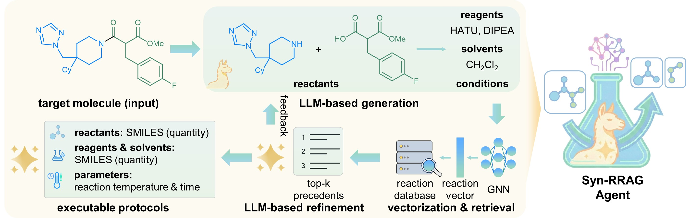

# Agentic-Syn-RRAG

Agentic-Syn-RRAG is the release repository for **Syn-RRAG**, a retrieval-augmented framework for single-step retrosynthesis and synthesis-protocol generation. Given a target product SMILES, the system combines a locally served SFT model, RXNGraphormer/FAISS precedent retrieval, LLM reranking, and LLM-guided protocol refinement.

This repository contains the inference and evaluation runtime, a 150-target evaluation set randomly sampled from the WIPO-2M held-out test set, example outputs from runs on that same set, and a patch for reproducing the SFT training workflow with LLaMA-Factory.


## Contents

- [Overview](#overview)
- [Repository structure](#repository-structure)
- [Environment setup](#environment-setup)
  - [Inference](#inference)
  - [Training](#training)
- [Quick start](#quick-start)
- [SFT training](#sft-training)
- [Benchmark and evaluation](#benchmark-and-evaluation)
- [Baselines and ablations](#baselines-and-ablations)
- [Citation](#citation)

## Overview

Syn-RRAG implements a **Generate–Retrieve–Refine** workflow:

1. **Generate** — the local SFT model generates candidate reactants through reaction-state beam search, followed by initial reagents and solvents.
2. **Retrieve** — RXNGraphormer embeds each proposed reaction, FAISS retrieves ten structurally similar patent precedents, and a re-ranking model selects the three most relevant records.
3. **Refine** — the configured main model evaluates the proposed pathway against the retrieved evidence, refines unsupported components, and produces a validated, structured protocol.


The ten retrieved precedents in step 2 are distinct from the final Top-10 pathway candidates produced when `--num_samples 10` is used.

<p align="center">
  
</p>

### Key features

The runtime supports:

- Generate–Retrieve–Refine workflow — integrates reaction generation, precedent retrieval and evidence-guided refinement to produce complete, executable protocols specifying reactants, reagents, solvents, quantities, temperature and reaction time.
- Reaction-state beam search — explores and ranks complete candidate reactions as reaction states, enabling diverse, chemically plausible routes across distinct reaction classes and disconnection strategies.
- Reaction-level precedent retrieval — embeds entire proposed reactions and retrieves relevant experimental precedents from a large patent-derived database.
- Symbolic chemical verification — evaluates molecular validity, elemental consistency and structural compatibility to filter implausible reaction hypotheses.
- Evidence-guided protocol refinement — corrects unsupported reaction components and completes missing experimental parameters using retrieved precedents.
- Automated synthesis compatibility — produces structured protocols suitable for robotic execution, experimentally validated through the successful synthesis of three virtually screened drug candidates.


## Repository structure

```text
.
├── OSCAR_main.py                      # LangGraph workflow construction
├── run_app.py                         # Benchmark, sharding, and ablation runner
├── predict_target_mols.py             # Product-only Top-k inference
├── OSCAR_generate_only_native.py      # Direct native-LLM baseline
├── nodes/
│   ├── rag_node.py                    # Retrieval, reranking, refinement, validation
│   ├── rag_node_simple.py             # Retrieval without semantic reranking
│   └── generate_only_node.py          # Retrieval-free refinement
├── mcp_tools/
│   ├── local_llm_mcp.py               # Local SFT model service
│   ├── self_refine_loop_agent.py      # Candidate generation and verification
│   ├── mcp_rag.py                     # Runtime retrieval/refinement MCP tool
│   ├── database_embedding.py          # RXNGraphormer query embedding and search
│   ├── save_load_embedding.py         # FAISS/database loading and persistence
│   └── retrieval_sys.py               # Offline index-building utility
├── utils/reaction_plausibility.py     # Element and scaffold checks
├── benchmark/                         # Extraction and evaluation scripts
├── evaluate/test_150.csv              # 150-target random sample
├── examples/                          # Example outputs (same 150)
├── target_mols/
│   ├── target_mol.csv                 # Three product SMILES (wet-lab confirmed)
│   └── target_mol_top10_predictions_clean.jsonl  # Syn-RRAG Top-10 on those targets
├── train_examples/                    # LLaMA-Factory patch; data_prep examples
├── pretrained_classification_model/   # RXNGraphormer model location
├── requirements_main.txt              # Main runtime environment
├── requirements_server.txt            # Local SFT service environment
└── .env.example                       # Endpoint/model configuration template
```

Large model weights, the reaction database, and its FAISS index are not included.

## Environment setup

The commands below assume Bash; adapt activation and line-continuation syntax on other shells.

```bash
git clone https://github.com/SamSamChu/Agentic-Syn-RRAG.git
cd Agentic-Syn-RRAG
```

### Inference

The main pipeline and the local SFT service use separate environments because their PyTorch and Transformers requirements differ.

**1. Main runtime** (Python 3.10):

```bash
conda create -n agentic-syn-rrag python=3.10 -y
conda activate agentic-syn-rrag

pip install -r requirements_main.txt \
  -f https://data.pyg.org/whl/torch-2.2.0+cpu.html \
  --extra-index-url https://download.pytorch.org/whl/cpu

git clone -b pytorch2 https://github.com/licheng-xu-echo/RXNGraphormer.git
pip install ./RXNGraphormer
```

**2. Local SFT service** (Python 3.12):

```bash
conda create -n syn-rrag-sft-server python=3.12 -y
conda activate syn-rrag-sft-server
pip install -r requirements_server.txt
```

The local checkpoint is loaded in bfloat16 with `device_map="auto"`; a compatible accelerator and sufficient memory are therefore expected for normal use.

**3. Download runtime assets** and place them as follows:

```text
Agentic-Syn-RRAG/
├── pretrained_classification_model/
│   ├── parameters.json                # already in this repository
│   └── model/                         # RXNGraphormer weights (ModelScope)
├── data/
│   ├── offline_reaction_database.json
│   ├── reaction_update.faiss
│   └── indices_map_update.npy
├── checkpoints/
│   └── syn-rrag-wipo/
└── evaluate/
    └── test_150.csv                    # already in this repository
```

`data/` is the retrieval corpus: reaction records in `offline_reaction_database.json`, plus a FAISS index and index map built from `s_reactants>>s_products`. Each record is one patent reaction (SMILES, reagents/solvents, and experimental procedure).

The WIPO SFT checkpoint and RXNGraphormer weights (`pretrained_classification_model/model/`) are on ModelScope at [justcoins/Syn-RRAG-Checkpoints](https://www.modelscope.cn/models/justcoins/Syn-RRAG-Checkpoints):

```bash
pip install modelscope-hub

ms-hub download justcoins/Syn-RRAG-Checkpoints \
  --repo-type model \
  --include 'syn-rrag-wipo/**' \
  --local-dir './checkpoints' \
  --max-workers 8

ms-hub download justcoins/Syn-RRAG-Checkpoints \
  --repo-type model \
  --include 'pretrained_classification_model/model/**' \
  --local-dir '.' \
  --max-workers 8
```

The reaction database, FAISS index, and index map are on [Figshare](https://figshare.com/s/9d568a8e2e2dcdf28925). Extract them into `data/`.

`syn-rrag-wipo` is the WIPO multi-task SFT. Pass `--model_path ./checkpoints/syn-rrag-wipo` to `local_llm_mcp.py`.

Inference does not need the Unsloth base model or the WIPO/USPTO training jsonl files.

### Training

Use a third environment for LLaMA-Factory SFT. Python 3.12 and CUDA 12.8 are recommended.

```bash
conda create -n syn-rrag-train python=3.12 -y
conda activate syn-rrag-train
```

Then clone, patch, and `pip install` LLaMA-Factory as in [SFT training](#sft-training).

**Base model.** WIPO SFT starts from Unsloth Llama-3-8B-Instruct ([`unsloth/llama-3-8b-Instruct`](https://huggingface.co/unsloth/llama-3-8b-Instruct) on Hugging Face). Download a local copy and set `model_name_or_path` in `wipo_multi_task_full.yaml`. Hugging Face gated access may require `hf auth login`.

**Training and eval jsonl.** `wipo_data.zip` and `data_uspto50.zip` are on [Figshare](https://figshare.com/s/9d568a8e2e2dcdf28925). Place them under `LlamaFactory/` as:

```text
LlamaFactory/
├── wipo_data/
│   ├── dataset_info.json
│   ├── train.jsonl
│   ├── valid.jsonl
│   └── test.jsonl
└── data_uspto50/
    ├── dataset_info.json
    ├── train_50k_class.json
    ├── valid_50k_class.json
    └── test_50k_class.json
```

**Released SFT weights (optional).** To skip WIPO training and only run USPTO, download `syn-rrag-wipo` from [justcoins/Syn-RRAG-Checkpoints](https://www.modelscope.cn/models/justcoins/Syn-RRAG-Checkpoints) and point `uspto_50k_class.yaml` at that folder. For USPTO Top-k evaluation, download `syn-rrag-uspto50` from the same repo and point `eval_dual.sh` at it (for example `checkpoints/syn-rrag-uspto50/`). Retrieval assets (`data/`, RXNGraphormer) are not required for SFT training.

Then continue with the commands in [SFT training](#sft-training).

## Quick start

Complete the inference environments and runtime downloads in [Environment setup → Inference](#inference) first. If that is not done yet, start there.

### 1. API credentials

```bash
cp .env.example .env
```

Fill at least `SOTA_API_KEY` and `RERANK_API_KEY`. Do not commit `.env` or API credentials. The full variable list is at the end of this section.

### 2. Start the local pathway service

Run the service in a dedicated terminal:

```bash
cd /path/to/Agentic-Syn-RRAG
conda activate syn-rrag-sft-server

python mcp_tools/local_llm_mcp.py \
  --model_path ./checkpoints/syn-rrag-wipo
```

The service listens on port `8000`. The inference entry points start `mcp_tools/mcp_rag.py` as a subprocess, so the retrieval tool does not require a second manually started service.

### 3. Predict synthesis plans from product SMILES

The bundled input is a headerless CSV of three product SMILES. These targets were confirmed in wet-lab experiments; the file is a short inference demo, not the 150-target evaluation set. Corresponding Syn-RRAG Top-10 outputs are in [`target_mols/target_mol_top10_predictions_clean.jsonl`](./target_mols/target_mol_top10_predictions_clean.jsonl).

```bash
conda activate agentic-syn-rrag

python predict_target_mols.py \
  -f target_mols/target_mol.csv \
  --num_samples 10 \
  -o target_mols/target_mol_top10_predictions.jsonl
```

For a headered CSV, pass `--smiles_column <column>`. Without that option, the script recognizes common names including `smiles`, `target_smiles`, `product_smiles`, and `s_products`. Every input SMILES is validated and canonicalized with RDKit before inference.

The output contains one pretty-printed JSON object per target. A checkpoint named `<output>.checkpoint.json` is maintained during execution and removed after all targets complete successfully. If a run is interrupted, rerunning the same command resumes from the checkpoint or existing output.

Optional modes:

```bash
# SFT proposal + final generation, without retrieval or reranking
python predict_target_mols.py -f target_mols/target_mol.csv --generate_only

# Structural retrieval without semantic reranking
python predict_target_mols.py -f target_mols/target_mol.csv --simple_rag
```

`--condition_sampling` affects only local SFT reagent/solvent generation. Reactant generation remains deterministic beam search. Its sampling controls are `--condition_temperature`, `--condition_top_p`, and `--condition_top_k`.

### 4. Batch inference (150 targets)

`run_app.py` is the benchmark and ablation entry point. Its input CSV must contain `k`, `v`, `s_products`, `s_reactants`, `s_reagents`, `s_solvents`, and a Python-literal-compatible `clean_response` field. The included `evaluate/test_150.csv` has 150 rows and the required columns.

A single-process run is:

```bash
python run_app.py \
  -f ./evaluate/test_150.csv \
  -s ./evaluate/syn_rrag_top10/model \
  -p ./evaluate/syn_rrag_top10/run \
  --num_samples 10 \
  --max_concurrency 1
```

For a multi-process run:

```bash
RUN_ID="$(date +%Y%m%d_%H%M%S)_syn_rrag_top10"
RUN_DIR="./evaluate/${RUN_ID}"
OUTPUT_STEM="01_gemini25_top10"
mkdir -p "$RUN_DIR"
printf '%s\n' "$OUTPUT_STEM" > "$RUN_DIR/OUTPUT_STEM.txt"

for sid in $(seq 0 9); do
  SHARD_DIR="$RUN_DIR/shard_${sid}"
  mkdir -p "$SHARD_DIR"
  nohup python run_app.py \
    -f ./evaluate/test_150.csv \
    -s "$SHARD_DIR/${OUTPUT_STEM}_model" \
    -p "$SHARD_DIR/${OUTPUT_STEM}_" \
    --num_samples 10 \
    --shard_id "$sid" \
    --num_shards 10 \
    --total_records 150 \
    --max_concurrency 1 \
    > "$SHARD_DIR/${OUTPUT_STEM}.log" 2>&1 &
done
```

Do not allow two processes to write to the same output prefix. Each shard writes:

- `${OUTPUT_STEM}_model.pkl`: a stream of pickled records;
- `${OUTPUT_STEM}_model.json`: pretty-printed, concatenated JSON objects, not a JSON array;
- `${OUTPUT_STEM}__checkpoint.json`: resumable progress, removed after that shard completes;
- `${OUTPUT_STEM}.log`: redirected process output from the command above.

After a 150-target run, compute metrics as in [Benchmark and evaluation](#benchmark-and-evaluation).

### API variables

| Variable | Used for | Default in code |
| --- | --- | --- |
| `SOTA_MODEL` | Final pathway review and protocol generation | `gemini-2.5-pro` |
| `SOTA_API_KEY` | Main-model API credential | none |
| `SOTA_BASE_URL` | OpenAI-compatible main-model endpoint | `https://www.litellm.org/` |
| `SOTA_TEMPERATURE` | Main-model temperature | `1.0` |
| `RERANK_MODEL` | Patent-precedent reranking | `gemini-2.5-flash` |
| `RERANK_API_KEY` | Reranking-model credential | none |
| `RERANK_BASE_URL` | OpenAI-compatible reranking endpoint | `https://www.litellm.org/` |
| `RERANK_TEMPERATURE` | Reranking temperature | `1.0` |
| `LLM_SERVER_URL` | Local SFT MCP endpoint | `http://localhost:8000/mcp` |
| `TEST_API_KEY`, `TEST_BASE_URL` | Evaluation-model credential and endpoint | endpoint defaults to LiteLLM |
| `TEST_JUDGE_MODEL_GPT` | Protocol judge | `gpt-5-pro` |
| `TEST_FAITHFULNESS_MODEL` | Faithfulness judge | `gpt-5-pro` |
| `TEST_FAITHFULNESS_TEMPERATURE` | Faithfulness-judge temperature | `1.0` in code |

`LLM_BASE_URL` is retained in `self_refine_loop_agent.py` for an OpenAI-compatible local client, but the current generation path communicates through `LLM_SERVER_URL`. The native baseline is also a legacy path: it reads `SOTA_MODEL` and `SOTA_API_KEY` but currently uses a fixed LiteLLM gateway URL.

## SFT training

Complete the training environment, Unsloth base model, and WIPO/USPTO jsonl files in [Environment setup → Training](#training) first. If that is not done yet, start there.

The steps below start in `train_examples/` after that. The training release is a patch against a fixed LLaMA-Factory revision, not a standalone trainer.

### 1. Prepare LLaMA-Factory

```bash
cd /path/to/Agentic-Syn-RRAG/train_examples
git clone https://github.com/hiyouga/LlamaFactory.git
cd LlamaFactory

git fetch origin 2b27283ba0566eda9ec7ac335642807189c87e70
git checkout 2b27283ba0566eda9ec7ac335642807189c87e70
git apply --check ../my_changes.patch
git apply ../my_changes.patch
```

The clone directory is `LlamaFactory`. The pinned commit is required because the patch modifies internal data loading, SFT workflow, and trainer files in addition to adding configs and evaluation utilities.

### 2. Install training dependencies

From the patched `LlamaFactory` directory, with `syn-rrag-train` active:

```bash
conda activate syn-rrag-train
pip install .
pip install -r ../requirements.txt \
  --extra-index-url https://download.pytorch.org/whl/cu128
```

Verify the actual environment before launching a long run:

```bash
python -c "import torch; print(torch.__version__, torch.cuda.is_available())"
```

### 3. Prepare model and datasets

Set `model_name_or_path` in `wipo_multi_task_full.yaml` to the local Unsloth directory from [Training](#training). Paths in the patch are environment-specific examples and must be changed.

Place Figshare jsonl files as shown there. The patch adds `dataset_info.json` templates under `data_wipo/` and `data_uspto50k/`; copy or link them into `wipo_data/` and `data_uspto50/`.

Patent HTML is turned into structured reaction records with [`train_examples/data_prep/demo.ipynb`](./train_examples/data_prep/demo.ipynb). Those records are then converted into SFT QA pairs (retrosynthesis, forward prediction, and condition prediction) by [`train_examples/data_prep/QA_construct_demo.py`](./train_examples/data_prep/QA_construct_demo.py).

The script ships two built-in reaction records. Run it from the repository root:

```bash
python train_examples/data_prep/QA_construct_demo.py
```

It prints SFT QA jsonl to stdout. Replace the samples in the script to use your own records from `demo.ipynb`.

### 4. Run training and SFT evaluation

Use syn-rrag-train. Commands assume `$LF_ROOT` unless noted.

```bash
export LF_ROOT=/path/to/Agentic-Syn-RRAG/train_examples/LlamaFactory
```

#### Step 1 — WIPO multi-task full SFT (4 GPUs)

Edit `wipo_multi_task_full.yaml`:

```yaml
model_name_or_path: $BASE                    # Unsloth Llama-3-8B-Instruct base
output_dir: saves/llama3-8b-full/wipo        # USPTO stage loads this path
learning_rate: 3.0e-5                        # 2e-5 to 5e-5; 3e-5 is an example
```

Confirm `dataset_dir: wipo_data` and that `wipo_data/train.jsonl` and `valid.jsonl` are in place.

```bash
conda activate syn-rrag-train
cd $LF_ROOT
bash train_wipo.sh 2>&1 | tee train_wipo.log
# equivalent:
# CUDA_VISIBLE_DEVICES=0,1,2,3 FORCE_TORCHRUN=1 llamafactory-cli train wipo_multi_task_full.yaml
```

#### Step 2 — WIPO evaluation

Must run from `$LF_ROOT/reaction_eval/wipo_eval` (relative paths in `eval.sh`).

Edit `eval.sh`:

```bash
model_id="$LF_ROOT/saves/llama3-8b-full/wipo"
dataset="$LF_ROOT/wipo_data/test.jsonl"
```

```bash
conda activate syn-rrag-train
cd $LF_ROOT/reaction_eval/wipo_eval
bash eval.sh 2>&1 | tee eval_wipo.log
```

#### Step 3 — USPTO-50K class fine-tuning (4 GPUs)

In `uspto_50k_class.yaml`, change only:

```yaml
model_name_or_path: saves/llama3-8b-full/wipo   # WIPO checkpoint from Step 1
```

On 4 GPUs keep `gradient_accumulation_steps: 2` so the global batch stays 32. Confirm `dataset_dir: data_uspto50/` and the jsonl files from §3.

```bash
conda activate syn-rrag-train
cd $LF_ROOT
bash train_uspto.sh 2>&1 | tee train_uspto.log
# 4 GPUs: CUDA_VISIBLE_DEVICES=0,1,2,3
```

#### Step 4 — USPTO-50K evaluation

Must run from `$LF_ROOT/reaction_eval/uspto_eval`.

Edit `eval_dual.sh`:

```bash
model_id="$LF_ROOT/saves/llama3-8b/uspto50_class"   # USPTO checkpoint from Step 3
test_data="$LF_ROOT/data_uspto50/test_50k_class.jsonl"
```

```bash
conda activate syn-rrag-train
cd $LF_ROOT/reaction_eval/uspto_eval
bash eval_dual.sh 2>&1 | tee eval_uspto50k.log
# default: 4 GPUs (--num_processes 4)
```

After export, place the Hugging Face checkpoint under `checkpoints/` (for example `checkpoints/syn-rrag-wipo/`). Use it with `mcp_tools/local_llm_mcp.py` as in [Quick start](#quick-start). Released checkpoints can also be downloaded from ModelScope as in [Inference](#inference).

## Benchmark and evaluation

### 150-target evaluation

We evaluate on 150 targets randomly sampled from the product-disjoint WIPO-2M held-out test set. The list is saved as evaluate/test_150.csv.

| Track | Evaluation setting | Reported result |
| --- | --- | --- |
| Standalone SFT backbone | WIPO-2M held-out test (~10k products) | Top-1/3/5/10: 44.5% / 65.1% / 70.8% / 75.9% |
| Full Syn-RRAG | 150 targets, Top-1 | Reactant accuracy: **48.0%** |
| SFT Llama | Same 150 targets | Reactant accuracy: 46.0% |
| Native Gemini-2.5-Pro | Same 150 targets | Reactant accuracy: 14.7% |
| Full Syn-RRAG rule checks | Same 150 targets, Top-1 | Validity: 100.0%; elemental consistency: 100.0%; structural compatibility: 99.3% |

### Metric definitions

| Metric | Implementation in this repository |
| --- | --- |
| Reactant accuracy | After RDKit canonicalization, every reference reactant component must appear in the pooled predicted reactants and reagents. The fields are pooled because a model may classify a true reactant as a reagent. |
| Molecular validity | Every predicted molecular component must parse and canonicalize with RDKit. |
| Elemental consistency | Every element type in the target product must occur in the predicted reactant/reagent pool; this is presence-only, not atom-count balancing. |
| Structural compatibility | Each substantial reactant fragment must satisfy the connected-MCS scaffold policy in `utils/reaction_plausibility.py`. |
| Full-protocol plausibility | An independent judge scores temperature/time, stoichiometry, solvent choice, and operational practicality from 0 to 10. |

In evaluation output, `local` denotes the SFT proposal, `agent` denotes Syn-RRAG, and `agent+alt` includes eligible alternative reactants. The latter is used only where the recorded reactant-revision policy allows it.

### Interpreting Top-k

The local generator pools results from milestone beam widths:

| Requested k | Beam-search calls |
| --- | --- |
| 1 | `[1]` |
| 3 | `[1, 3]` |
| 5 | `[1, 3, 5]` |
| 10 | `[1, 3, 5, 10]` |

Candidates are canonicalized, checked, pooled, deduplicated, sorted, and truncated to the requested k. Therefore, Top-1/3/5 metrics from a completed Top-10 run use prefixes of the final pooled ranking. They need not equal results from independent `--num_samples 1`, `3`, or `5` runs.

### Extract Top-1 and compute rule-based metrics

Set `RUN_DIR` to a completed sharded run and reuse its output stem:

```bash
OUTPUT_STEM="${OUTPUT_STEM:-01_gemini25_top10}"
SHARD_PATTERN="shard_*/${OUTPUT_STEM}_model.json"

python benchmark/extract_top1_from_top10.py \
  --input_dir "$RUN_DIR" \
  --pattern "$SHARD_PATTERN"

mkdir -p "$RUN_DIR/metrics"
python benchmark/evaluate_reactant_metrics.py \
  --input_dir "$RUN_DIR" \
  --pattern "$SHARD_PATTERN" \
  --output_prefix "$RUN_DIR/metrics/reactant"
```

Top-1 files are written to `RUN_DIR/derived/top1_from_top10/`. Metric outputs are `<prefix>_summary.json` and `<prefix>_per_record.csv`.

### Protocol judge and faithfulness

```bash
TOP1_FILE="$RUN_DIR/derived/top1_from_top10/top1_from_top10.json"
JUDGE_DIR="./benchmark/${RUN_ID}/top1_from_top10"
JUDGE_PREFIX="$JUDGE_DIR/syn_rrag_top1_"
mkdir -p "$JUDGE_DIR"

python benchmark/prepare_llm_judge_dataset.py \
  --input_file "$TOP1_FILE" \
  --prefix "$JUDGE_PREFIX"

python benchmark/test_API_with_self_correction_gpt.py \
  --input_file "${JUDGE_PREFIX}llm_judge_eval_results.json" \
  --prefix "$JUDGE_PREFIX"

python benchmark/test_API_with_faithfulness_score.py \
  --input_file "${JUDGE_PREFIX}llm_judge_eval_results.json" \
  --prefix "$JUDGE_DIR/syn_rrag_faithfulness_top1_"
```

Use `--test_offline` with the faithfulness script only when its audit CSV already exists and only the summary should be recomputed.

### Example outputs

Example outputs from the 150-target evaluation runs, plus the three wet-lab-confirmed targets:

| File | Contents |
| --- | --- |
| [`examples/gemini25_top10_display.json`](./examples/gemini25_top10_display.json) | Full Syn-RRAG pathways, retrieved/reranked evidence, and final recipes |
| [`examples/native_top1_display.csv`](./examples/native_top1_display.csv) | Native-LLM Top-1 records; despite the extension, this is concatenated JSON content |
| [`examples/generate_only_top1_display.json`](./examples/generate_only_top1_display.json) | Retrieval-free Top-1 outputs |
| [`target_mols/target_mol_top10_predictions_clean.jsonl`](./target_mols/target_mol_top10_predictions_clean.jsonl) | Syn-RRAG Top-10 on the three wet-lab-confirmed product targets |

API metadata and credentials are not included.

## Baselines and ablations

### Native LLM

This path asks the configured main model for a complete protocol without the local SFT generator or retrieval:

```bash
python OSCAR_generate_only_native.py \
  -f ./evaluate/test_150.csv \
  -s ./native/gemini25_top1/model \
  -p ./native/gemini25_top1/run
```

The runner writes concatenated JSON records to a `.csv`-named file and a pickle stream. `prepare_llm_judge_dataset.py` handles this legacy format.

### Syn-w/o-RRAG

This ablation retains SFT pathway proposal and final protocol generation but removes precedent retrieval and semantic reranking:

```bash
python run_app.py \
  -f ./evaluate/test_150.csv \
  -s ./evaluate/generate_only_top1/model \
  -p ./evaluate/generate_only_top1/run \
  --generate_only \
  --num_samples 1
```

## Citation

Please cite the paper and this repository when using the code, evaluation data, or examples.


## License

This project is licensed under the [MIT License](./LICENSE).

Copyright (c) 2026 SamSamChu.
